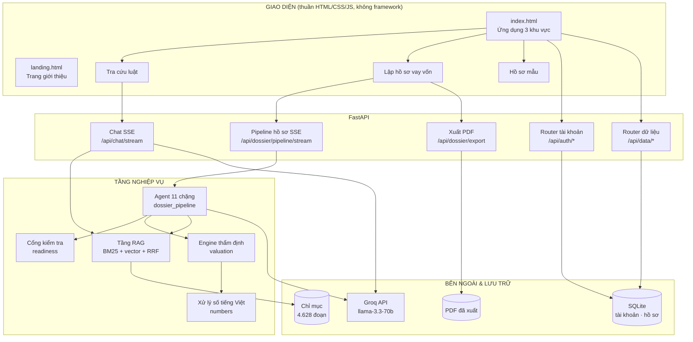
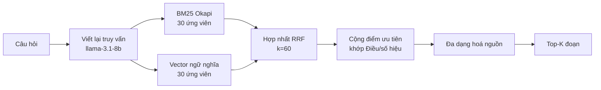
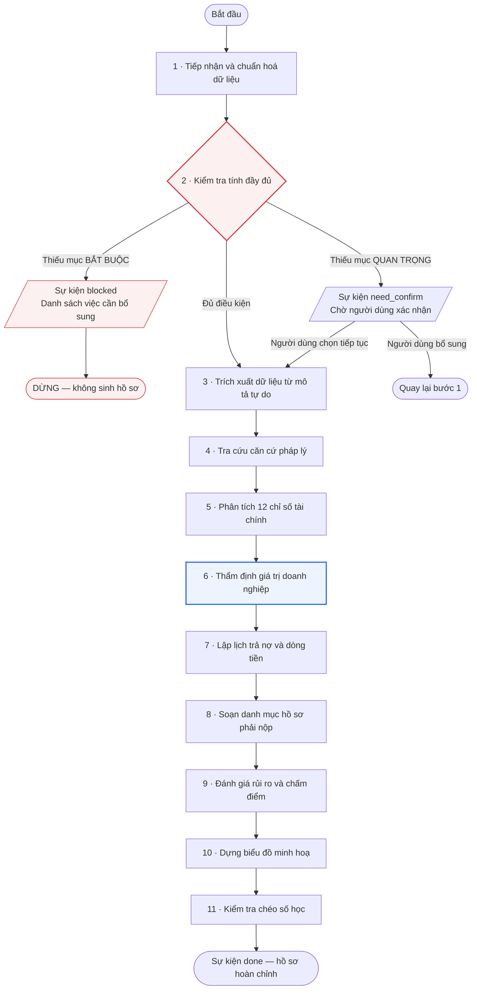
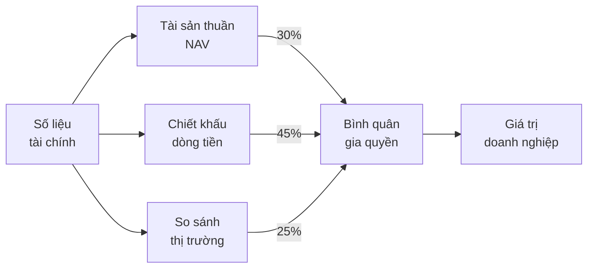
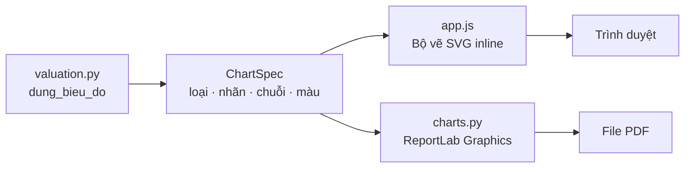
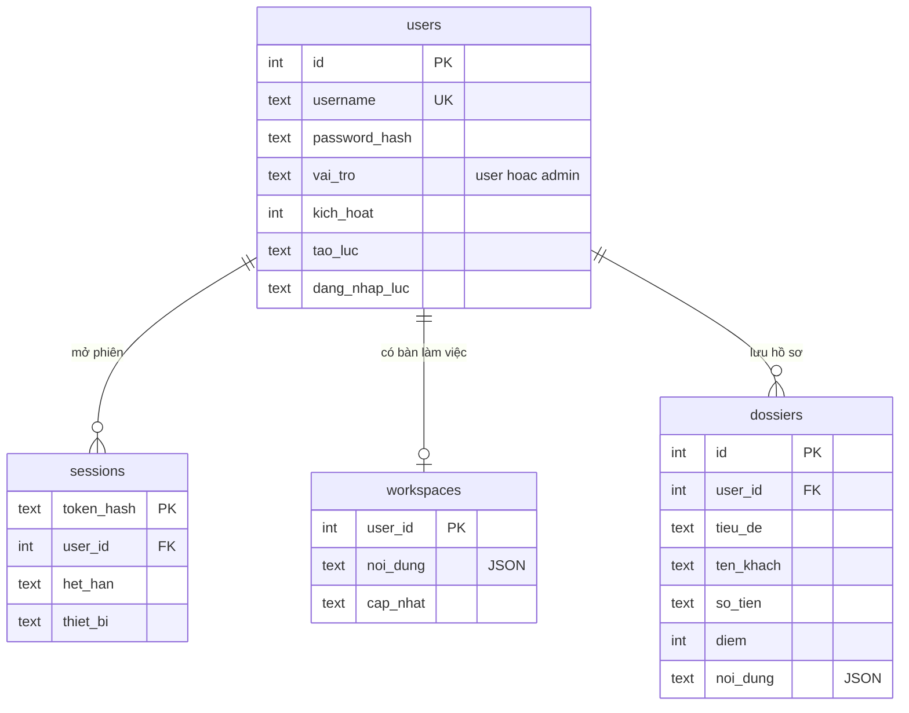
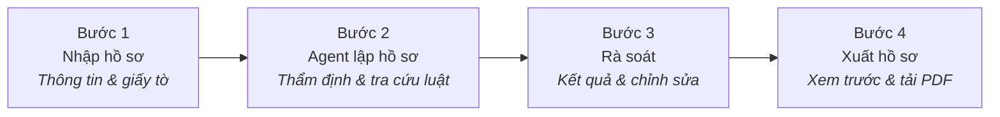
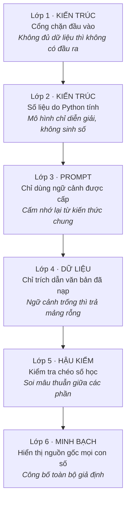

# BÁO CÁO KỸ THUẬT
## Trợ lý Pháp chế Tín dụng — Hệ thống tra cứu pháp luật và lập hồ sơ vay vốn ngân hàng

| | |
|---|---|
| **Tên hệ thống** | Trợ lý Pháp chế Tín dụng (Legal Assistant for Bank Lending) |
| **Loại sản phẩm** | Ứng dụng web, kiến trúc RAG + Agent nhiều chặng |
| **Ngày báo cáo** | 08/08/2026 |
| **Bản đang chạy** | https://web-production-6a7ed.up.railway.app |
| **Quy mô mã nguồn** | 8.353 dòng Python · 5.455 dòng frontend (không dùng framework) |
| **Kho tri thức hiện có** | 33 văn bản quy phạm pháp luật · 4.628 đoạn đã lập chỉ mục |

---

## MỤC LỤC

1. [Tóm tắt điều hành](#1-tóm-tắt-điều-hành)
2. [Bài toán và phạm vi](#2-bài-toán-và-phạm-vi)
3. [Kiến trúc tổng thể](#3-kiến-trúc-tổng-thể)
4. [Tầng RAG — tra cứu văn bản pháp luật](#4-tầng-rag--tra-cứu-văn-bản-pháp-luật)
5. [Quy trình lập hồ sơ vay vốn (Agent 11 chặng)](#5-quy-trình-lập-hồ-sơ-vay-vốn-agent-11-chặng)
6. [Cổng kiểm tra đầu vào](#6-cổng-kiểm-tra-đầu-vào)
7. [Engine thẩm định giá trị doanh nghiệp](#7-engine-thẩm-định-giá-trị-doanh-nghiệp)
8. [Chấm điểm tín dụng](#8-chấm-điểm-tín-dụng)
9. [Trực quan hoá dữ liệu](#9-trực-quan-hoá-dữ-liệu)
10. [Xuất hồ sơ PDF](#10-xuất-hồ-sơ-pdf)
11. [Tài khoản, phiên và dữ liệu người dùng](#11-tài-khoản-phiên-và-dữ-liệu-người-dùng)
12. [Giao diện người dùng](#12-giao-diện-người-dùng)
13. [Hồ sơ vay vốn mẫu](#13-hồ-sơ-vay-vốn-mẫu)
14. [Cơ chế chống bịa đặt](#14-cơ-chế-chống-bịa-đặt)
15. [Danh mục API](#15-danh-mục-api)
16. [Cấu trúc mã nguồn](#16-cấu-trúc-mã-nguồn)
17. [Triển khai và vận hành](#17-triển-khai-và-vận-hành)
18. [Kiểm thử](#18-kiểm-thử)
19. [Giới hạn đã biết và hướng phát triển](#19-giới-hạn-đã-biết-và-hướng-phát-triển)

---

## 1. Tóm tắt điều hành

Hệ thống giải quyết hai bài toán liên quan chặt chẽ trong nghiệp vụ tín dụng ngân hàng:

**Một là tra cứu pháp luật có kiểm chứng.** Cán bộ tín dụng đặt câu hỏi bằng tiếng Việt tự nhiên,
hệ thống tìm trong kho văn bản quy phạm pháp luật đã nạp và trả lời **kèm trích dẫn tới từng
Điều — Khoản**, hiển thị nguyên văn đoạn luật gốc để người dùng đối chiếu ngay.

**Hai là lập hồ sơ đề nghị cấp tín dụng.** Đây là phần trọng tâm về mặt kỹ thuật. Hệ thống không
đơn thuần điền form, mà chạy một quy trình **11 chặng** gồm: kiểm tra tính đầy đủ của đầu vào →
tra cứu căn cứ pháp lý → phân tích 12 chỉ số tài chính → **thẩm định giá trị doanh nghiệp theo 3
phương pháp độc lập** → lập lịch trả nợ và tính DSCR → soạn danh mục hồ sơ phải nộp → đánh giá rủi
ro và chấm điểm tín dụng → dựng biểu đồ → kiểm tra chéo số học → xuất PDF 13 trang.

Ba đặc điểm kỹ thuật đáng chú ý:

**(a) Cổng chặn đầu vào.** Chặng 2 đối chiếu 18 quy tắc thông tin và 15 loại giấy tờ bắt buộc. Nếu
còn thiếu mục bắt buộc, quy trình **dừng hẳn** và trả về danh sách việc cần bổ sung — không sinh ra
bất kỳ nội dung nào. Đây là biện pháp trực tiếp chống việc mô hình ngôn ngữ "lấp chỗ trống" bằng
thông tin tự nghĩ.

**(b) Số liệu do máy tính, không do mô hình sinh.** Toàn bộ chỉ số tài chính, định giá doanh nghiệp,
lịch trả nợ, DSCR và điểm tín dụng đều là công thức tường minh viết bằng Python. Mô hình ngôn ngữ
chỉ được giao việc *diễn giải* kết quả đã tính, và bị ràng buộc phải sao chép đúng con số.

**(c) Quy trình minh bạch với người dùng.** Mỗi chặng phát sự kiện theo giao thức SSE, giao diện
hiển thị trực tiếp Agent đang làm gì, đã tìm được điều khoản nào, tính ra con số nào — thay vì để
người dùng chờ trước một màn hình trống.

---

## 2. Bài toán và phạm vi

### 2.1 Bối cảnh nghiệp vụ

Việc lập một bộ hồ sơ đề nghị cấp tín dụng đòi hỏi ba loại năng lực khác nhau:

| Năng lực | Nội dung | Khó khăn thực tế |
|---|---|---|
| Pháp lý | Xác định điều kiện vay vốn, danh mục giấy tờ, căn cứ điều khoản áp dụng | Văn bản nhiều, sửa đổi liên tục, dễ dẫn sai điều khoản |
| Tài chính | Phân tích báo cáo tài chính, định giá doanh nghiệp, tính khả năng trả nợ | Tính tay tốn thời gian, dễ nhầm, khó chuẩn hoá giữa các cán bộ |
| Trình bày | Soạn hồ sơ đúng thể thức, đầy đủ mục, có bảng biểu và biểu đồ | Lặp đi lặp lại, mất nhiều giờ cho mỗi hồ sơ |

### 2.2 Phạm vi hệ thống

**Trong phạm vi:**
- Tra cứu quy định pháp luật Việt Nam về hoạt động cho vay của tổ chức tín dụng.
- Lập hồ sơ đề nghị cấp tín dụng cho khách hàng cá nhân, hộ kinh doanh và doanh nghiệp.
- Thẩm định giá trị doanh nghiệp phục vụ mục đích tham chiếu tín dụng.
- Chấm điểm tín dụng nội bộ theo bộ tiêu chí công khai.

**Ngoài phạm vi:**
- Không thay thế chứng thư thẩm định giá của tổ chức có chức năng thẩm định giá độc lập.
- Không thay thế ý kiến tư vấn pháp lý chính thức.
- Không kết nối hệ thống core banking hay CIC.
- Không ra quyết định cấp tín dụng — chỉ đưa ra đề xuất để cán bộ có thẩm quyền xem xét.

### 2.3 Đối tượng sử dụng

Chuyên viên quan hệ khách hàng, cán bộ thẩm định tín dụng, chuyên viên pháp chế ngân hàng, và
doanh nghiệp tự chuẩn bị hồ sơ trước khi nộp.

---

## 3. Kiến trúc tổng thể

### 3.1 Sơ đồ khối



### 3.2 Nguyên tắc thiết kế

**Tách bạch tính toán và sinh văn.** Ranh giới rõ ràng: mọi con số đi qua `valuation.py` và
`numbers.py`; mô hình ngôn ngữ chỉ chạm vào phần diễn giải và soạn thảo. Ranh giới này là lý do
kết quả tài chính của hệ thống có thể kiểm chứng và tái lập được.

**Chặn sớm thay vì sửa muộn.** Cổng kiểm tra nằm ở chặng 2, trước mọi lời gọi mô hình tốn kém.
Hồ sơ thiếu thì dừng ngay, không tiêu tốn token và không tạo ra nội dung phải bỏ đi.

**Không phụ thuộc phần mềm nặng.** Backend chỉ cần 8 gói bắt buộc. Frontend không dùng framework,
không bước build — mở file là chạy. Embedding có hai đường: dùng `sentence-transformers` nếu cài
được, không thì tự lùi về TF-IDF thuần NumPy.

**Toàn bộ mã và giao diện bằng tiếng Việt.** Tên hàm, tên biến, chú thích, thông báo lỗi đều tiếng
Việt để cán bộ nghiệp vụ đọc hiểu và góp ý được trực tiếp vào mã nguồn.

### 3.3 Công nghệ sử dụng

| Tầng | Công nghệ | Lý do chọn |
|---|---|---|
| Web framework | FastAPI + Uvicorn | Hỗ trợ SSE tự nhiên, tự sinh tài liệu OpenAPI, kiểu dữ liệu chặt |
| Kiểm tra dữ liệu | Pydantic v2 | Xác thực schema hai chiều giữa API và mô hình |
| Mô hình ngôn ngữ | Groq API (`llama-3.3-70b-versatile`) | Tốc độ suy luận cao, chi phí thấp, có chế độ JSON |
| Tìm kiếm | BM25 Okapi + TF-IDF hashing, thuần NumPy | Không cần dịch vụ vector ngoài, chạy được trên máy nhỏ |
| Cơ sở dữ liệu | SQLite (chế độ WAL) | Không cần máy chủ riêng, đi theo volume của Railway |
| Xuất PDF | ReportLab (Platypus + Graphics) | Kiểm soát tuyệt đối bố cục, vẽ được biểu đồ vector |
| Bảo mật | `hashlib` + `secrets` (thư viện chuẩn) | PBKDF2-HMAC-SHA256, không thêm phụ thuộc |
| Frontend | HTML/CSS/JS thuần | Không bước build, tải nhanh, dễ bảo trì lâu dài |

---

## 4. Tầng RAG — tra cứu văn bản pháp luật

### 4.1 Bóc tách và cắt đoạn theo cấu trúc văn bản

Đây là điểm khác biệt so với cách cắt đoạn thông thường. Văn bản quy phạm pháp luật Việt Nam có
cấu trúc phân cấp rõ ràng, và **trích dẫn pháp lý bắt buộc phải chỉ đúng tới Điều — Khoản**. Vì
vậy `chunker.py` không cắt theo số ký tự mà theo đúng cấu trúc văn bản:

```
Phần → Chương → Mục → Điều → Khoản
```

Mỗi đoạn (chunk) mang theo metadata đầy đủ: số hiệu văn bản, tên Chương, tên Mục, số Điều, tiêu đề
Điều. Nhờ đó trích dẫn trả về đúng dạng nghiệp vụ: `Điều 7, Thông Tư 39/2016/TT-NHNN`.

Hệ thống tự nhận diện số hiệu văn bản theo mẫu `\d{1,4}/\d{4}/[A-ZĐ-]+` và các biến thể hợp nhất
(`VBHN-VPQH`).

**Định dạng hỗ trợ:** PDF, DOCX, TXT, MD, HTML. Với PDF scan không có lớp text, hệ thống phát hiện
và cảnh báo thay vì nạp dữ liệu rác vào chỉ mục.

### 4.2 Truy hồi lai (hybrid retrieval)



**Bước viết lại truy vấn** dùng mô hình nhỏ (`llama-3.1-8b-instant`) để thay đại từ bằng danh từ cụ
thể và bổ sung thuật ngữ pháp lý đồng nghĩa. Ví dụ "thế chấp nhà" được mở rộng thành "thế chấp
quyền sử dụng đất tài sản bảo đảm". Câu hỏi gốc vẫn được giữ để không mất từ khoá người dùng gõ.

**Tokenizer tiếng Việt** sinh cả unigram, bigram và bản không dấu — xử lý được trường hợp người
dùng gõ thiếu dấu.

**Hợp nhất RRF** (Reciprocal Rank Fusion, `k = 60`) kết hợp thứ hạng từ hai nhánh mà không cần
chuẩn hoá điểm số giữa hai thang đo khác nhau.

**Cộng điểm ưu tiên** khi câu hỏi trỏ đích danh:

| Trường hợp | Điểm cộng |
|---|---|
| Câu hỏi nêu "Điều X" và đoạn đúng là Điều X | +0,35 |
| Câu hỏi nêu số hiệu văn bản khớp đoạn | +0,25 |
| Tiêu đề Điều trùng ≥ 2 thuật ngữ với câu hỏi | +0,05 mỗi từ, tối đa +0,20 |

**Đa dạng hoá** giới hạn số đoạn lấy từ cùng một văn bản và loại đoạn trùng Điều, để câu trả lời
được dẫn từ nhiều nguồn thay vì lặp lại một điều khoản.

### 4.3 Chiến lược embedding hai đường

| Backend | Điều kiện | Số chiều |
|---|---|---|
| `sentence-transformers` | Khi cài được `torch` — hiểu ngữ nghĩa đa ngôn ngữ | 384 |
| TF-IDF hashing (mặc định) | Thuần NumPy, luôn chạy được | 4.096 |

Hệ thống tự chọn, không cần cấu hình. Với văn bản pháp luật, TF-IDF cho kết quả khá tốt vì người
dùng thường gõ đúng thuật ngữ chuyên ngành.

### 4.4 Kho tri thức hiện tại

33 văn bản, 4.628 đoạn, khoảng 4 triệu ký tự. Toàn bộ lấy từ **bản sắp chữ của Công báo Chính phủ**
(`congbao.chinhphu.vn`) hoặc bản hợp nhất `VBHN-VPQH` — có lớp text thật nên bóc tách được đầy đủ
cấu trúc.

Các văn bản lớn nhất trong kho:

| Văn bản | Số đoạn |
|---|---|
| Bộ luật Dân sự 91/2015/QH13 | 744 |
| Luật Đất đai 31/2024/QH15 | 565 |
| Nghị định 99/2022/NĐ-CP (đăng ký biện pháp bảo đảm) | 393 |
| Luật Nhà ở 27/2023/QH15 | 387 |
| Luật Các tổ chức tín dụng 32/2024/QH15 | 359 |
| Luật Doanh nghiệp 59/2020/QH14 | 344 |
| Thông tư 22/2019/TT-NHNN (giới hạn, tỷ lệ bảo đảm an toàn) | 160 |
| Thông tư 41/2016/TT-NHNN (tỷ lệ an toàn vốn) | 137 |

> **Ghi chú kỹ thuật quan trọng:** bản PDF "văn bản gốc có chữ ký" trên `vbpl.vn` là **bản scan kèm
> OCR hỏng** (mất dấu, vỡ chữ, sai số hiệu). Đã kiểm tra và loại bỏ toàn bộ khỏi kho. Chi tiết
> nguồn từng văn bản xem `NGUON-VAN-BAN.md`.

---

## 5. Quy trình lập hồ sơ vay vốn (Agent 11 chặng)

### 5.1 Sơ đồ luồng



### 5.2 Chi tiết từng chặng

| # | Mã chặng | Loại xử lý | Nội dung |
|---|---|---|---|
| 1 | `tiep_nhan` | Thuần Python | Chuẩn hoá dữ liệu: "5 tỷ" → `5.000.000.000 VND`, "60 tháng" → 60 kỳ; sinh số tiền bằng chữ; dựng danh mục giấy tờ theo loại hình khách hàng |
| 2 | `kiem_tra` | Thuần Python | **Cổng chặn.** Đối chiếu 18 quy tắc thông tin + 15 loại giấy tờ |
| 3 | `trich_xuat` | LLM (JSON) | Bóc tài sản bảo đảm, số liệu tài chính, khoản mục sử dụng vốn từ đoạn văn khách viết tự do. Chỉ điền vào ô trống, không ghi đè dữ liệu người dùng |
| 4 | `tra_cuu` | RAG | Dựng truy vấn từ chính nội dung khoản vay, lấy 12 đoạn luật liên quan nhất |
| 5 | `phan_tich` | Thuần Python | Tính 12 chỉ số tài chính kèm ngưỡng tham chiếu và xếp loại |
| 6 | `dinh_gia` | Thuần Python | Định giá theo 3 phương pháp, bình quân gia quyền |
| 7 | `dong_tien` | Thuần Python | Chia lịch trả nợ theo tháng, gộp về từng năm, tính DSCR |
| 8 | `checklist` | LLM (JSON) + Python | Soạn danh mục tài liệu kèm căn cứ pháp lý; sau đó **bù nốt** các giấy tờ chuẩn còn thiếu bằng đối chiếu từ khoá |
| 9 | `rui_ro` | LLM (JSON) + Python | Điểm tín dụng do Python tính; mô hình nhận diện rủi ro và viết khuyến nghị dựa trên số liệu đã có |
| 10 | `bieu_do` | Thuần Python | Dựng tối đa 7 biểu đồ từ số liệu đã tính |
| 11 | `hoan_tat` | Thuần Python | Kiểm tra chéo số học giữa các phần của hồ sơ |

**Tỷ lệ xử lý:** 8/11 chặng là tính toán thuần Python. Chỉ 3 chặng gọi mô hình ngôn ngữ, và cả ba
đều dùng chế độ JSON có ràng buộc schema.

### 5.3 Giao thức sự kiện SSE

Quy trình phát sự kiện theo chuẩn Server-Sent Events để giao diện hiển thị tiến độ thời gian thực:

| Sự kiện | Thời điểm | Nội dung |
|---|---|---|
| `plan` | Ngay khi bắt đầu | Danh sách 11 chặng để giao diện vẽ sẵn timeline |
| `step` | Vào/ra mỗi chặng | `ma`, `trang_thai`, `ghi_chu`, `tien_do`, `giay` |
| `log` | Trong khi chạy | Một dòng mô tả việc vừa làm xong |
| `sources` | Sau chặng 4 | Danh sách điều khoản đã tra cứu |
| `partial` | Giữa chừng | Hồ sơ ở trạng thái dở dang, để giao diện cập nhật sớm |
| `warning` | Bất kỳ lúc nào | Cảnh báo không chặn |
| `blocked` | Chặng 2 | **Thiếu mục bắt buộc — dừng hẳn** |
| `need_confirm` | Chặng 2 | Thiếu mục quan trọng — chờ xác nhận |
| `done` | Kết thúc | Hồ sơ hoàn chỉnh + nguồn + báo cáo kiểm tra + cảnh báo chéo |
| `error` | Khi có lỗi | Thông báo lỗi |

**Trạng thái chặng:** `dang_chay` · `xong` · `bo_qua` · `canh_bao` · `chan` · `loi`.

Ví dụ nhật ký thực tế chạy trên hồ sơ mẫu:

```
[xong     ] tiep_nhan    Đã chuẩn hoá dữ liệu đầu vào                    (0,2s)
[xong     ] kiem_tra     Hồ sơ đủ điều kiện — cho phép lập               (0,3s)
[bo_qua   ] trich_xuat   Không có mô tả tự do — bỏ qua                   (0,3s)
[xong     ] tra_cuu      Tìm được 12 điều khoản liên quan                (0,6s)
           › [1] Điều 7, Thông Tư 39/2016/TT-NHNN
           › [2] Điều 102, Luật 32/2024/QH15
[xong     ] phan_tich    Tính được 12/12 chỉ số                          (2,0s)
           › ROE — Tỷ suất sinh lời trên vốn chủ sở hữu: 13,9% → Đạt
[xong     ] dinh_gia     Giá trị doanh nghiệp 35,69 tỷ VND               (2,0s)
           › Phương pháp tài sản thuần (NAV): 24,50 tỷ VND
           › Phương pháp chiết khấu dòng tiền (DCF): 43,49 tỷ VND
           › Phương pháp so sánh thị trường: 35,08 tỷ VND
[xong     ] dong_tien    5 kỳ trả nợ · DSCR bình quân 4,31 lần           (2,0s)
[xong     ] checklist    20 tài liệu · 6 căn cứ                          (6,6s)
[xong     ] rui_ro       5 rủi ro · 5 khuyến nghị                        (9,8s)
[xong     ] bieu_do      Dựng 7 biểu đồ                                  (9,8s)
[xong     ] hoan_tat     Hồ sơ đã hoàn chỉnh                             (9,9s)
```

**Thời gian chạy thực đo:** khoảng 10–35 giây tuỳ độ dài hồ sơ và tải của Groq API.

### 5.4 Kiểm tra chéo số học (chặng 11)

Chặng cuối soi các mâu thuẫn mà mô hình ngôn ngữ hay bỏ sót:

| Kiểm tra | Ngưỡng cảnh báo |
|---|---|
| Tổng khoản mục sử dụng vốn so với tổng nguồn vốn (vốn vay + vốn tự có) | Lệch quá 15% |
| Số tiền vay so với tổng giá trị tài sản bảo đảm | Vay > giá trị TSBĐ (LTV > 100%) |
| Số tiền vay so với giá trị doanh nghiệp sau thẩm định | Vay > giá trị doanh nghiệp |
| Tỷ lệ tài liệu trong checklist có căn cứ pháp lý | Không tài liệu nào có căn cứ |

Cảnh báo hiển thị trực tiếp trên giao diện và trong khối trạng thái ở cột phải.

---

## 6. Cổng kiểm tra đầu vào

### 6.1 Vì sao cần

Mô hình ngôn ngữ có xu hướng "lấp chỗ trống": thiếu dữ liệu thì tự nghĩ ra nội dung nghe hợp lý.
Trong hồ sơ tín dụng, một con số bịa hay một điều khoản dẫn sai có hậu quả thực. Cổng kiểm tra là
biện pháp kiến trúc: **không đủ đầu vào thì không có đầu ra**, thay vì trông chờ prompt ngăn được
mô hình.

### 6.2 Ba mức độ

| Mức | Ký hiệu | Hành vi |
|---|---|---|
| **Bắt buộc** | `bat_buoc` | Thiếu là **chặn**, không sinh hồ sơ |
| **Quan trọng** | `quan_trong` | Không chặn, nhưng phải bấm xác nhận mới chạy tiếp |
| **Nên có** | `nen_co` | Chỉ nhắc để hồ sơ thuyết phục hơn |

### 6.3 Bộ quy tắc thông tin (18 quy tắc)

| Nhóm | Mục bắt buộc | Mục quan trọng |
|---|---|---|
| Thông tin khách hàng | Tên · Loại hình · Số CCCD/ĐKKD | Địa chỉ · Ngành nghề · Người đại diện |
| Nhu cầu vay vốn | Số tiền · Thời hạn · Mục đích vay | Lãi suất · Phương thức trả nợ · Vốn tự có |
| Phương án sử dụng vốn | Tóm tắt phương án (≥ 40 ký tự) · Nguồn trả nợ (≥ 25 ký tự) | Khoản mục sử dụng vốn |
| Tài chính | Số liệu tài chính | — |
| Tài sản bảo đảm | Tài sản bảo đảm (trừ khi khai rõ vay tín chấp) | — |

Một số quy tắc có logic riêng thay vì chỉ kiểm tra rỗng:
- **Số tiền vay** phải phân tích ra được số dương, không chỉ là chuỗi khác rỗng.
- **Người đại diện** không bắt buộc khi khách hàng là cá nhân tự vay.
- **Số liệu tài chính** chấp nhận hoặc bảng số liệu, hoặc đoạn mô tả dài ≥ 40 ký tự có chứa chữ số.
- **Tài sản bảo đảm** được miễn nếu khách hàng khai rõ "vay tín chấp" trong phần ghi chú.

### 6.4 Danh mục giấy tờ theo loại hình khách hàng

Danh mục tự đổi khi người dùng chọn loại hình:

| Loại hình | Số loại giấy tờ | Bắt buộc |
|---|---|---|
| Cá nhân / Hộ kinh doanh / Hộ gia đình | 11 | 9 |
| Doanh nghiệp (TNHH, cổ phần, DNTN, HTX…) | 15 | 12 |

Chia thành 4 nhóm nghiệp vụ: **Hồ sơ pháp lý** · **Hồ sơ khoản vay** · **Hồ sơ tài chính** ·
**Hồ sơ tài sản bảo đảm**.

Ví dụ khác biệt: khách hàng doanh nghiệp phải có *Nghị quyết Hội đồng thành viên/Quản trị về việc
vay vốn và thế chấp tài sản*, còn khách hàng cá nhân phải có *Giấy xác nhận tình trạng hôn nhân* và
*Văn bản đồng ý thế chấp của đồng sở hữu*.

### 6.5 Công thức chấm điểm đầy đủ

```
Điểm đầy đủ = (Tổng trọng số − Trọng số các mục còn thiếu) / Tổng trọng số × 100

Trọng số:  bắt buộc = 3,0   quan trọng = 1,5   nên có = 0,5
```

Với khách hàng doanh nghiệp: tổng 22 mục bắt buộc (10 quy tắc thông tin + 12 giấy tờ).

### 6.6 Trải nghiệm khi bị chặn

Màn hình chặn không chỉ liệt kê mục thiếu mà với mỗi mục nêu rõ ba điều:

1. **Thiếu gì** — tên mục.
2. **Vì sao cần** — ví dụ: *"Thiếu số tiền thì không tính được lịch trả nợ, DSCR, LTV hay hạn mức
   đề xuất."*
3. **Cách bổ sung** — ví dụ: *"Nhập số tiền, ví dụ 5.000.000.000 hoặc 5 tỷ."*

Bấm vào bất kỳ mục nào sẽ chuyển về bước 1, mở đúng phần chứa trường đó, cuộn tới nơi và làm nổi ô
nhập tương ứng.

Cột phải hiển thị tiến độ theo từng nhóm dưới dạng thanh ngang, cập nhật theo thời gian thực khi
người dùng gõ (gọi API sau 600 ms kể từ lần gõ cuối).

---

## 7. Engine thẩm định giá trị doanh nghiệp

Đây là khối kỹ thuật phức tạp nhất, đặt trong `app/services/valuation.py` (1.091 dòng).
**Toàn bộ tính bằng Python, không có lời gọi mô hình ngôn ngữ nào.**

### 7.1 Bóc số liệu tài chính

Người dùng nhập bảng số liệu với tên chỉ tiêu tự do. Hệ thống khớp tên về 19 khoá chuẩn bằng đối
chiếu chuỗi đã bỏ dấu, theo thứ tự ưu tiên từ cụ thể đến tổng quát:

```
doanh_thu · gia_von · loi_nhuan_gop · loi_nhuan_truoc_thue · loi_nhuan_sau_thue
ebitda · khau_hao · chi_phi_lai_vay · tai_san_ngan_han · tong_tai_san
hang_ton_kho · phai_thu · tien · no_ngan_han · no_vay · no_phai_tra
von_chu_so_huu · thu_nhap · chi_phi_sinh_hoat
```

Sau đó **suy ra các chỉ tiêu còn thiếu** từ quan hệ kế toán cơ bản:

| Quan hệ | Công thức |
|---|---|
| Vốn chủ sở hữu | Tổng tài sản − Nợ phải trả |
| Nợ phải trả | Tổng tài sản − Vốn chủ sở hữu |
| Lợi nhuận trước thuế | Lợi nhuận sau thuế ÷ (1 − 20%) |
| Lợi nhuận gộp | Doanh thu − Giá vốn |
| EBITDA | LNTT + Khấu hao + Chi phí lãi vay |

### 7.2 Xử lý số tiền tiếng Việt

Module `numbers.py` (333 dòng) giải quyết một vấn đề thực tế: người dùng và mô hình đều gõ tiền
theo đủ kiểu.

| Đầu vào | Kết quả |
|---|---|
| `5.000.000.000` | 5.000.000.000 |
| `5 tỷ` | 5.000.000.000 |
| `1,2 tỷ đồng` | 1.200.000.000 |
| `180 triệu/tháng` | 180.000.000 |
| `9,5%/năm` | 9,5 (phần trăm, không phải tiền) |
| `trong 3 năm` | *không phải tiền* → bỏ qua |

Quy ước Việt Nam dùng dấu chấm ngăn hàng nghìn và dấu phẩy ngăn thập phân, ngược với quy ước Anh–
Mỹ. Bộ phân tích xử lý cả hai và các trường hợp nhập nhằng (`0,095` là 0,095 chứ không phải 95 —
nhóm hàng nghìn không bao giờ mở đầu bằng số 0).

Có hàm riêng `doc_tien_trong_cau()` cho các dòng mô tả nhiều số:

> `"Mua 04 xe đầu kéo (đơn giá 1.600.000.000/xe): 6.400.000.000 VND"` → **6.400.000.000**

Hàm này ưu tiên **số cuối cùng có kèm đơn vị tiền tệ**, thay vì số đầu tiên gặp được. Đây là kết
quả sửa một lỗi phát hiện trong quá trình kiểm thử — cách cũ đọc ra "04" và làm tổng khoản mục sử
dụng vốn sai lệch 91%.

Module cũng có hàm **đọc số thành chữ** để tự điền mục "bằng chữ" của hồ sơ:

> 4.521.000.000 → *"Bốn tỷ năm trăm hai mươi mốt triệu đồng chẵn"*

Xử lý đúng các biến thể tiếng Việt: *mốt* (21), *tư* (24), *lăm* (25), *lẻ* (105).

### 7.3 Ba phương pháp định giá



#### (a) Phương pháp tài sản thuần — trọng số 30%

```
Giá trị = Tổng tài sản − Nợ phải trả
```

Là mức sàn tham chiếu, chưa tính giá trị thương hiệu và lợi thế kinh doanh.

#### (b) Phương pháp chiết khấu dòng tiền — trọng số 45%

**Bước 1 — Tính tỷ suất chiết khấu WACC** từ chính cơ cấu vốn của khách hàng:

```
Re = Lãi suất phi rủi ro + β × Phần bù rủi ro thị trường + Phần bù quy mô
   = 3,5% + 1,10 × 8,5% + 3,0%  =  15,85%

Rd = Lãi suất vay khách hàng đang đề nghị × (1 − thuế TNDN 20%)

           Vốn chủ sở hữu              Nợ vay (gồm cả khoản vay mới)
WACC = ───────────────────── × Re + ────────────────────────────── × Rd
        Vốn chủ + Nợ vay                  Vốn chủ + Nợ vay
```

WACC được giới hạn trong khoảng [9%, 20%] để tránh giá trị phi thực tế.

**Bước 2 — Tính dòng tiền tự do năm cơ sở:**

```
EBIT   = Lợi nhuận trước thuế + Chi phí lãi vay
NOPAT  = EBIT × (1 − 20%)
ΔVLĐ   = 10% × mức tăng doanh thu
FCFF₀  = NOPAT + Khấu hao − Đầu tư duy trì − ΔVLĐ
```

Giả định **đầu tư duy trì bằng khấu hao** nên hai khoản này triệt tiêu, còn `FCFF₀ = NOPAT − ΔVLĐ`.

**Bước 3 — Dự báo 5 năm và giá trị cuối kỳ:**

```
FCFFₙ = FCFF₀ × (1 + g)ⁿ                          với g = tăng trưởng doanh thu thực tế,
                                                       giới hạn trần 12%/năm

                    FCFF₅ × (1 + g_vv)
Giá trị cuối kỳ = ─────────────────────            với g_vv = 3%/năm
                       WACC − g_vv

              5      FCFFₙ         Giá trị cuối kỳ
EV  =  Σ  ───────────────  +  ─────────────────
            n=1   (1 + WACC)ⁿ        (1 + WACC)⁵

Giá trị vốn chủ sở hữu = EV − Nợ vay ròng
                       = EV − (Nợ vay − Tiền và tương đương tiền)
```

Phương pháp tự loại nếu lợi nhuận không dương, dòng tiền tự do âm, hoặc `WACC ≤ g_vv + 0,5%`.

#### (c) Phương pháp so sánh thị trường — trọng số 25%

```
Theo P/E        : Giá trị = Lợi nhuận sau thuế × 8,0
Theo EV/EBITDA  : Giá trị = EBITDA × 5,5 − Nợ vay ròng
Kết quả         : bình quân các hệ số áp dụng được
```

Hệ số tham chiếu là mặt bằng doanh nghiệp cùng quy mô chưa niêm yết, đã chiết khấu cho tính thanh
khoản thấp của phần vốn góp.

#### (d) Kết luận

```
Giá trị kết luận = Σ (Giá trị phương pháp i × Trọng số i)
```

Phương pháp nào thiếu dữ liệu thì bị loại và **trọng số được phân bổ lại** cho các phương pháp còn
lại. Ví dụ nếu chỉ NAV và DCF áp dụng được, trọng số thành 40% / 60%.

Hệ thống cũng công bố **khoảng giá trị hợp lý**: từ giá trị thấp nhất trong các phương pháp (hoặc
85% kết luận) đến giá trị cao nhất (hoặc 115% kết luận).

### 7.4 Tính minh bạch của giả định

Toàn bộ 8 giả định được in ra kèm căn cứ, để cán bộ thẩm định kiểm chứng được từng con số:

| Giả định | Giá trị mẫu | Căn cứ |
|---|---|---|
| Kỳ số liệu cơ sở | 2025 | Cột "Năm hiện tại" trong bảng tài chính |
| Chi phí vốn chủ sở hữu (Re) | 15,9% | 3,5% + 1,10 × 8,5% + 3,0% |
| Chi phí nợ sau thuế (Rd) | 7,6% | 9,5% × (1 − 20%) |
| Tỷ suất chiết khấu (WACC) | 12,7% | Bình quân gia quyền theo cơ cấu vốn |
| Tăng trưởng giai đoạn dự báo | 12,0% | Tốc độ tăng doanh thu thực tế, trần 12%/năm |
| Tăng trưởng vĩnh viễn | 3,0% | Xấp xỉ tăng trưởng dài hạn của nền kinh tế |
| Hệ số P/E và EV/EBITDA | 8,0 / 5,5 lần | Mặt bằng SME chưa niêm yết |
| Trọng số các phương pháp | 30/45/25% | Phân bổ lại cho phương pháp đủ dữ liệu |

### 7.5 Bộ 12 chỉ số tài chính

| # | Chỉ số | Công thức | Ngưỡng tham chiếu |
|---|---|---|---|
| 1 | Tăng trưởng doanh thu | (DT kỳ này / DT kỳ trước − 1) × 100 | ≥ 5%/năm |
| 2 | Biên lợi nhuận sau thuế | LNST / Doanh thu | ≥ 5% |
| 3 | ROA | LNST / Tổng tài sản | ≥ 5% |
| 4 | ROE | LNST / Vốn chủ sở hữu | ≥ 12% |
| 5 | Hệ số nợ trên vốn chủ | Nợ phải trả / VCSH | ≤ 2,5 lần |
| 6 | Hệ số tự tài trợ | VCSH / Tổng tài sản | ≥ 30% |
| 7 | Hệ số thanh toán hiện hành | TS ngắn hạn / Nợ ngắn hạn | ≥ 1,2 lần |
| 8 | Vòng quay hàng tồn kho | Giá vốn / Hàng tồn kho | ≥ 4 vòng/năm |
| 9 | Hệ số khả năng trả lãi vay | (LNTT + Lãi vay) / Lãi vay | ≥ 2 lần |
| 10 | **DSCR** | (LNST + Khấu hao − Nghĩa vụ nợ hiện hữu) / (Trả gốc + Trả lãi) | ≥ 1,2 lần |
| 11 | **LTV** | Số tiền vay / Tổng giá trị TSBĐ | ≤ 70% |
| 12 | Tỷ lệ vốn tự có | Vốn tự có / (Vốn tự có + Vốn vay) | ≥ 20% |

Mỗi chỉ số được xếp loại **Tốt / Đạt / Cần lưu ý / Không đủ dữ liệu** và hiển thị kèm ý nghĩa
nghiệp vụ.

> **Ghi chú về DSCR:** công thức trừ nghĩa vụ nợ hiện hữu (lãi vay hiện tại + dư nợ vay ÷ 5 năm kỳ
> hạn bình quân giả định). Không trừ phần này thì DSCR bị thổi phồng, vì dòng tiền của cả doanh
> nghiệp được đem so với riêng nghĩa vụ của khoản vay mới. Trên hồ sơ mẫu, việc này đưa DSCR từ
> 7,59 lần về **2,86 lần** — sát thực tế hơn nhiều.

### 7.6 Lịch trả nợ

Hệ thống nhận diện phương thức trả nợ từ mô tả của người dùng và tính lịch theo tháng, sau đó gộp
về từng năm:

| Phương thức | Nhận diện từ khoá | Công thức |
|---|---|---|
| Gốc đều (mặc định) | — | Gốc tháng = P / n; Lãi = Dư nợ × r |
| Niên kim | "niên kim", "cố định hàng tháng" | A = P·r / (1 − (1+r)⁻ⁿ) |
| Gốc cuối kỳ | "gốc cuối kỳ", "cuối kỳ" | Lãi hàng tháng, gốc trả một lần |

Bảng dòng tiền kết quả gồm 8 cột: Kỳ · Dòng tiền vào · Trả gốc · Trả lãi · Tổng phải trả · Còn lại ·
Dư nợ cuối kỳ · DSCR.

---

## 8. Chấm điểm tín dụng

### 8.1 Thang điểm 100

| Cấu phần | Điểm tối đa | Căn cứ chấm |
|---|---|---|
| Khả năng trả nợ (DSCR) | 30 | ≥ 2,0 lần: 30đ · ≥ 1,5: 26đ · ≥ 1,2: 21đ · ≥ 1,0: 13đ · < 1,0: 6đ |
| Hiệu quả sinh lời | 25 | ROE (15đ) + Biên lợi nhuận sau thuế (10đ) |
| Cơ cấu vốn và thanh khoản | 15 | Hệ số nợ/VCSH (8đ) + Thanh toán hiện hành (7đ) |
| Bảo đảm tiền vay | 20 | LTV ≤ 50%: 20đ · ≤ 70%: 17đ · ≤ 90%: 12đ · > 90%: 6đ |
| Mức độ đầy đủ hồ sơ | 10 | Điểm đầy đủ từ cổng kiểm tra ÷ 10 |

Cấu phần nào thiếu dữ liệu nhận điểm mặc định trung tính, không bị chấm 0.

### 8.2 Xếp hạng và đề xuất

| Điểm | Xếp hạng | Mức rủi ro | Đề xuất |
|---|---|---|---|
| ≥ 92 | AAA | Thấp | Đủ điều kiện xem xét cấp tín dụng theo đề nghị |
| 84 – 91 | AA | Thấp | Đủ điều kiện xem xét cấp tín dụng theo đề nghị |
| 74 – 83 | A | Thấp | Đủ điều kiện xem xét cấp tín dụng theo đề nghị |
| 64 – 73 | BBB | Trung bình | Có thể xem xét cấp tín dụng kèm điều kiện bổ sung |
| 54 – 63 | BB | Trung bình | Có thể xem xét cấp tín dụng kèm điều kiện bổ sung |
| 44 – 53 | B | Cao | Chưa đủ cơ sở đề xuất — cần bổ sung hồ sơ, cơ cấu lại phương án |
| < 44 | CCC | Cao | Chưa đủ cơ sở đề xuất — cần bổ sung hồ sơ, cơ cấu lại phương án |

**Hạn mức đề xuất** cũng gắn với điểm: ≥ 74 điểm đề xuất đủ mức khách hàng xin; 54–73 điểm đề xuất
80% mức xin; dưới 54 điểm chưa xác định.

### 8.3 Điều kiện kèm theo tự sinh

Hệ thống tự phát sinh điều kiện cấp tín dụng dựa trên chỉ số thực tế:

| Điều kiện | Kích hoạt khi |
|---|---|
| Bổ sung tài sản bảo đảm để LTV về ≤ 70% | LTV > 70% |
| Kéo dài thời hạn hoặc giảm quy mô vay để DSCR ≥ 1,2 lần | DSCR < 1,2 |
| Nâng tỷ lệ vốn tự có lên ≥ 20% | Vốn tự có < 20% |
| Giảm hệ số nợ/VCSH xuống < 2,5 lần trước giải ngân | Nợ/VCSH > 2,5 |
| Giải ngân chuyển khoản trực tiếp cho bên thụ hưởng | Luôn có |
| Kiểm tra sử dụng vốn định kỳ và sau mỗi lần giải ngân | Luôn có |

---

## 9. Trực quan hoá dữ liệu

### 9.1 Kiến trúc một nguồn — hai bộ vẽ

Cùng một cấu trúc `ChartSpec` được vẽ bởi hai bộ độc lập, đảm bảo bản web và bản PDF luôn khớp
nhau về số liệu, màu sắc và nhãn:



### 9.2 Bảng màu đã kiểm định

Bảng màu được kiểm định bằng công cụ tự động trên 5 tiêu chí:

| Tiêu chí | Kết quả |
|---|---|
| Dải độ sáng (L 0,43–0,77) | **Đạt** — cả 6 màu |
| Ngưỡng sắc độ (chroma ≥ 0,1) | **Đạt** — cả 6 màu |
| Phân biệt khi mù màu (ΔE ≥ 8) | **Đạt** — cặp kém nhất ΔE 9,1 (protan) |
| Phân biệt mắt thường (ΔE ≥ 15) | **Đạt** — cặp kém nhất ΔE 19,6 |
| Tương phản với nền (≥ 3:1) | **Cảnh báo** — 3 màu dưới ngưỡng |

Cảnh báo tương phản dẫn tới một ràng buộc thiết kế bắt buộc: **mọi cột và điểm dữ liệu đều mang
nhãn giá trị**, và mỗi biểu đồ có nút chuyển sang **dạng bảng**. Người dùng không bao giờ phải dựa
vào màu sắc đơn thuần để đọc số liệu.

Thứ tự màu cố định, không xoay vòng: xanh dương `#2a78d6` → cam `#eb6834` → xanh ngọc `#1baf7a` →
vàng `#eda100` → hồng `#e87ba4` → xanh lá `#008300`. Đường ngưỡng dùng màu trạng thái `#d03b3b`,
vẽ nét đứt để phân biệt với đường dữ liệu.

### 9.3 Bảy biểu đồ

| Mã | Loại | Nội dung | Điều kiện xuất hiện |
|---|---|---|---|
| `kqkd` | Cột nhóm | Doanh thu và lợi nhuận sau thuế qua các kỳ | Có số liệu tài chính |
| `dinh_gia` | Cột ngang | Giá trị theo 3 phương pháp + kết luận (tô đậm) | Định giá thực hiện được |
| `tra_no` | Cột nhóm | Dòng tiền tạo ra vs nghĩa vụ trả nợ theo năm | Có lịch trả nợ |
| `du_no` | Đường | Dư nợ vay còn lại cuối mỗi năm | Có lịch trả nợ |
| `dscr` | Đường + ngưỡng | DSCR theo năm, kèm đường ngưỡng 1,2 lần | Có dòng tiền vào |
| `nguon_von` | Vành khuyên | Cơ cấu vốn tự có vs vốn vay | Có cả hai số |
| `tsbd` | Cột ngang | Giá trị từng tài sản bảo đảm | Có tài sản bảo đảm |

Biểu đồ nào không đủ dữ liệu thì **không xuất hiện**, thay vì vẽ ra một khung trống.

### 9.4 Quy tắc trình bày

- Nét mảnh, lưới mờ, không hiệu ứng 3D hay đổ bóng.
- Chừa 2px giữa các cột cạnh nhau để mắt tách được khối màu.
- Điểm trên biểu đồ đường có vòng trắng bao quanh để hai đường cắt nhau vẫn đọc được.
- Thang trục chọn theo dãy 1 · 1,2 · 1,5 · 2 · 2,5 · 3 · 4 · 5 · 6 · 8 · 10 × 10ⁿ để số đọc dễ mà
  không phí chỗ trống.
- Từ 2 chuỗi trở lên luôn có chú giải; một chuỗi thì tiêu đề đã nói rõ.

---

## 10. Xuất hồ sơ PDF

### 10.1 Cấu trúc tài liệu

File PDF sinh ra có **13 trang** với 12 mục đánh số La Mã:

| Mục | Nội dung |
|---|---|
| — | **Trang bìa** — Quốc hiệu, tiêu đề, bên vay, nơi nhận, bảng tóm tắt khoản vay, **kết quả thẩm định và điểm tín dụng**, tóm tắt phương án |
| I | Thông tin bên đề nghị vay vốn |
| II | Nội dung đề nghị cấp tín dụng |
| III | Phương án sử dụng vốn và trả nợ *(kèm biểu đồ cơ cấu vốn, khả năng trả nợ, DSCR, dư nợ)* |
| IV | Tình hình tài chính *(kèm biểu đồ doanh thu – lợi nhuận)* |
| V | Phân tích chỉ số tài chính |
| VI | **Thẩm định giá trị doanh nghiệp** — giả định · kết quả 3 phương pháp · chi tiết từng phương pháp · bảng chiết khấu dòng tiền · nhận xét |
| VII | Tài sản bảo đảm *(kèm biểu đồ)* |
| VIII | Kết luận thẩm định và đề xuất — cấu phần điểm · điểm mạnh · điểm cần lưu ý · điều kiện kèm theo |
| IX | Danh mục hồ sơ phải nộp *(có cột "Đã có" để tích tay)* |
| X | Căn cứ pháp lý áp dụng |
| XI | Đánh giá rủi ro và biện pháp giảm thiểu |
| XII | Khuyến nghị hoàn thiện hồ sơ |
| — | Khối chữ ký hai bên + tuyên bố miễn trừ |

### 10.2 Kỹ thuật dựng file

**Canvas hai lượt** để in được "Trang x / y" — số trang tổng chỉ biết sau khi dựng xong toàn bộ.
Từ trang 2 trở đi có đầu trang ghi tên hồ sơ và tên khách hàng.

**Font tiếng Việt** dò tự động: ưu tiên DejaVu Sans đóng gói sẵn trong `app/pdfout/fonts/`, sau đó
tới font hệ thống. Có đủ 4 biến thể regular/bold/italic/bold-italic.

**Biểu đồ vector** vẽ bằng ReportLab Graphics — không nhúng ảnh bitmap, nên phóng to bao nhiêu vẫn
nét và dung lượng file nhỏ.

**Rút gọn số tiền** trong bảng nhiều cột: `4.090.000.000 VND` hiển thị thành `4,09 tỷ VND` để bảng
8 cột vẫn đọc được trên khổ A4.

**Giữ khối** (`KeepTogether`) cho biểu đồ và khối chữ ký để không bị cắt ngang trang.

**Kích thước thực tế:** 147 KB cho 13 trang có 7 biểu đồ.

### 10.3 Tuỳ chọn xuất

Người dùng bật/tắt được 4 khối: danh mục hồ sơ phải nộp · căn cứ pháp lý · thẩm định giá trị doanh
nghiệp · biểu đồ minh hoạ.

Bản PDF được lưu lại trên máy chủ tại `data/exports/u{id người dùng}/`, tách theo tài khoản để hai
người có khách hàng trùng tên không ghi đè file của nhau.

---

## 11. Tài khoản, phiên và dữ liệu người dùng

### 11.1 Lược đồ cơ sở dữ liệu



SQLite chạy chế độ **WAL** với `synchronous=NORMAL` — cho phép đọc song song trong khi ghi, phù hợp
với FastAPI chạy nhiều luồng. Mỗi thao tác mở một kết nối riêng, bật `foreign_keys=ON` để xoá tài
khoản là xoá sạch dữ liệu liên quan.

File CSDL nằm trong `data/app.db`, cùng thư mục volume của Railway nên **dữ liệu còn nguyên sau mỗi
lần deploy lại**.

### 11.2 Bảo mật

| Hạng mục | Cách làm |
|---|---|
| Băm mật khẩu | PBKDF2-HMAC-SHA256, **240.000 vòng**, muối ngẫu nhiên 16 byte |
| Định dạng lưu | Tự mô tả: `thuật_toán$số_vòng$muối$giá_trị_băm` — đổi tham số sau này không phá dữ liệu cũ |
| So khớp | `hmac.compare_digest` — thời gian hằng số, không lộ thông tin qua thời gian phản hồi |
| Token phiên | `secrets.token_urlsafe(36)`, chỉ xuất hiện đúng một lần |
| Lưu token | **Chỉ lưu bản băm SHA-256** — lộ file CSDL cũng không mạo danh được phiên đang mở |
| Cookie | `HttpOnly` (JavaScript không đọc được) · `SameSite=Lax` · `Secure` tự bật khi chạy HTTPS |
| Nhận diện HTTPS | Đọc `X-Forwarded-Proto` vì Railway đứng sau proxy |
| Đổi mật khẩu | Tự động đóng mọi phiên khác, giữ lại đúng phiên đang thao tác |

Hệ thống **không dùng thư viện mã hoá bên thứ ba** — chỉ `hashlib`, `hmac` và `secrets` của thư
viện chuẩn Python.

### 11.3 Phân quyền

| Vai trò | Quyền |
|---|---|
| `user` | Tra cứu luật · Lập hồ sơ · Xem/xuất hồ sơ của mình · Xem kho văn bản |
| `admin` | Toàn bộ quyền của `user` + Nạp/xoá văn bản pháp luật + Quản lý tài khoản |

Kho văn bản pháp luật **dùng chung toàn hệ thống**: ai đăng nhập cũng tra cứu được, nhưng chỉ quản
trị viên mới được nạp thêm hay xoá đi.

**Khởi tạo quản trị viên:** nếu CSDL trống, người đăng ký đầu tiên tự động trở thành quản trị viên.
Hoặc đặt sẵn `ADMIN_USERNAME` / `ADMIN_PASSWORD` trong biến môi trường.

**Chốt an toàn:** quản trị viên không thể tự khoá hoặc tự xoá tài khoản của chính mình.

### 11.4 Đồng bộ dữ liệu

**Bàn làm việc** lưu toàn bộ nội dung đang nhập dở dưới dạng JSON, đồng bộ tự động giữa các máy của
cùng một tài khoản — người dùng nhập dở ở cơ quan, về nhà mở máy khác là làm tiếp được.

**Kho hồ sơ đã lưu** giữ nhiều bản, mỗi bản có tiêu đề, tên khách hàng, số tiền và điểm tín dụng để
tra nhanh.

---

## 12. Giao diện người dùng

### 12.1 Cấu trúc

| Trang | Đường dẫn | Nội dung |
|---|---|---|
| Trang giới thiệu | `/` | Giới thiệu tính năng, kêu gọi đăng nhập |
| Ứng dụng | `/app` | 3 khu vực: Tra cứu luật · Hồ sơ vay vốn · Hồ sơ mẫu |

### 12.2 Khu vực Hồ sơ vay vốn — 4 bước



**Bước 2** là điểm nhấn về trải nghiệm. Thay vì một vòng quay chờ, người dùng thấy timeline 11
chặng với: trạng thái từng chặng, thời gian đã chạy, kết quả tóm tắt, và **nhật ký chi tiết việc
Agent vừa làm**. Thanh tiến độ dính ngay dưới phần đầu trang, cuộn đi đâu vẫn thấy.

### 12.3 Cột phải thời gian thực

| Khối | Nội dung |
|---|---|
| Mức độ hoàn thiện | Vòng tròn phần trăm + 3 chỉ số nhanh (số tài liệu, căn cứ, rủi ro) |
| Điều kiện lập hồ sơ | Trạng thái từng nhóm dưới dạng thanh ngang + danh sách mục còn thiếu bấm được |
| Thao tác | Lập hồ sơ · Xem trước · Xuất PDF · Nhập/Lưu JSON · Nạp dữ liệu mẫu |
| Tuỳ chọn xuất file | 4 công tắc bật/tắt khối nội dung |
| Trạng thái | Kết quả lần chạy gần nhất + cảnh báo kiểm tra chéo |
| Căn cứ đã tra cứu | Danh sách điều khoản hệ thống vừa dùng |

### 12.4 Chi tiết kỹ thuật frontend

**Không framework, không bước build.** Toàn bộ là HTML/CSS/JS thuần: 2.323 dòng `app.js`,
374 dòng `auth.js`, 371 dòng `base.css` (token thiết kế), 1.052 dòng `styles.css`.

**Giao diện sáng/tối** với ba trạng thái: theo hệ điều hành (mặc định), sáng, tối. Lựa chọn được
nhớ lại; script chọn giao diện chạy trước khi vẽ để không bị nháy màu.

**Bộ icon SVG sprite** nhúng thẳng trong HTML — không tải file ngoài, đổi màu theo giao diện.

**Markdown renderer tự viết** cho phần chat: hỗ trợ tiêu đề, danh sách, bảng, khối mã, trích dẫn,
và **chip trích dẫn `[1]` bấm được** để nhảy tới đoạn luật gốc tương ứng.

**Bộ vẽ biểu đồ SVG** khoảng 200 dòng, hỗ trợ 4 loại: cột nhóm, cột ngang, đường (có đường ngưỡng),
vành khuyên.

**Lưu trữ hai tầng:** `localStorage` cho phản hồi tức thì, đồng bộ lên máy chủ để dùng được nhiều
máy.

**Responsive** từ màn hình rộng xuống điện thoại: ở khổ hẹp, thanh bên thu vào sau nút ☰, lưới 2
cột chuyển thành 1 cột, thanh bước cuộn ngang.

---

## 13. Hồ sơ vay vốn mẫu

### 13.1 Mục đích

Người dùng lần đầu không biết một bộ hồ sơ đầy đủ trông như thế nào và cần những gì. Tab **Hồ sơ
mẫu** cung cấp một bản hoàn chỉnh để làm chuẩn tham chiếu.

### 13.2 Nội dung

**Khách hàng giả định:** Công ty TNHH Vận tải Đông Dương — vận tải hàng hoá đường bộ (mã ngành
4933), tuyến container Hà Nội – Đà Nẵng.

**Khoản vay:** 5.000.000.000 VND, thời hạn 60 tháng, lãi suất 9,5%/năm, mục đích mua 04 xe đầu kéo
kèm bổ sung vốn lưu động. Vốn tự có tham gia 2 tỷ đồng.

**Kết quả hệ thống tính ra:**

| Hạng mục | Kết quả |
|---|---|
| Giá trị doanh nghiệp | **35.688.530.724 VND** |
| — theo tài sản thuần | 24.500.000.000 VND (trọng số 30%) |
| — theo chiết khấu dòng tiền | 43.488.401.609 VND (trọng số 45%) |
| — theo so sánh thị trường | 35.075.000.000 VND (trọng số 25%) |
| Điểm tín dụng | **90/100 — xếp hạng AA — rủi ro Thấp** |
| DSCR bình quân | 2,86 – 6,12 lần theo từng năm |
| LTV | 47,2% |
| Số chỉ số tài chính | 12 |
| Số giả định định giá công bố | 8 |
| Số tài liệu trong checklist | 23 |
| Số căn cứ pháp lý | 10 |
| Số rủi ro đã nhận diện | 6 |
| Số biểu đồ | 7 |
| Số trang PDF | 13 |

### 13.3 Điểm kỹ thuật đáng chú ý

Phần thẩm định trong hồ sơ mẫu **không viết cứng**. Module `ho_so_mau.py` chỉ khai báo dữ liệu đầu
vào (thông tin doanh nghiệp, bảng tài chính, tài sản bảo đảm), sau đó **chạy qua đúng engine
`valuation.py` của hệ thống**. Nhờ vậy:

1. Hồ sơ mẫu luôn nhất quán với những gì khách hàng thật sẽ nhận được.
2. Bất kỳ thay đổi nào trong engine đều phản ánh ngay vào hồ sơ mẫu.
3. Hồ sơ mẫu đóng vai trò như một **bài kiểm thử hồi quy** cho toàn bộ khối tính toán.

### 13.4 Ba cách sử dụng

| Nút | Tác dụng |
|---|---|
| **Xem bản PDF đầy đủ** | Mở file PDF 13 trang trong tab mới |
| **Nạp dữ liệu này vào form của tôi** | Điền toàn bộ vào form để sửa lại theo khách hàng thật |
| **Tải file JSON** | Xuất dữ liệu để nghiên cứu cấu trúc hoặc chia sẻ |

---

## 14. Cơ chế chống bịa đặt

Đây là yêu cầu cốt lõi với một hệ thống pháp lý – tài chính. Hệ thống áp dụng **sáu lớp bảo vệ**
độc lập nhau:



### Chi tiết từng lớp

**Lớp 1 — Cổng chặn.** Thiếu thông tin hoặc giấy tờ bắt buộc thì quy trình dừng, không sinh nội
dung nào. Đây là biện pháp mạnh nhất vì nó loại bỏ tình huống khiến mô hình phải bịa.

**Lớp 2 — Tách tính toán khỏi sinh văn.** 8/11 chặng là Python thuần. Ba chặng dùng mô hình đều
nhận số liệu đã tính sẵn kèm chỉ dẫn *"nhiệm vụ của bạn là diễn giải, không phải tính lại và cũng
không được thay đổi con số"*.

**Lớp 3 — Ràng buộc prompt.** Prompt hệ thống buộc mô hình chỉ dùng ngữ cảnh được cấp, mọi khẳng
định phải kèm chỉ số nguồn `[1]` và số Điều — Khoản. Khi truy hồi không ra kết quả, mô hình được
lệnh nói thẳng *"kho văn bản hiện có chưa đủ căn cứ"*. Khi chưa nạp văn bản nào, hệ thống chuyển
sang prompt riêng bắt buộc gắn nhãn cảnh báo.

**Lớp 4 — Ràng buộc dữ liệu.** Prompt soạn căn cứ pháp lý ghi rõ: *"CHỈ được ghi văn bản và điều
khoản thực sự xuất hiện trong NGỮ CẢNH PHÁP LÝ. Nếu ngữ cảnh trống thì trả về mảng rỗng — tuyệt
đối không nhớ lại từ kiến thức chung."* Riêng phần hồ sơ, mô hình bị cấm bịa tên người, số tiền,
mã số thuế — trường nào không có dữ liệu thì để trống.

**Lớp 5 — Hậu kiểm.** Chặng 11 soi mâu thuẫn số học giữa các phần và cảnh báo lên giao diện.

**Lớp 6 — Minh bạch.** Mỗi câu trả lời hiển thị nguyên văn đoạn luật gốc đã dùng, bấm chip `[1]` là
nhảy tới nguồn. Mỗi chỉ số tài chính đi kèm công thức tính. Mỗi giả định định giá đi kèm căn cứ.

### Tuyên bố miễn trừ

Cả PDF và giao diện đều in rõ:

> *Tài liệu được lập tự động bởi hệ thống, mang tính tham khảo. Nội dung cần được rà soát bởi cán
> bộ có thẩm quyền trước khi nộp cho tổ chức tín dụng. Kết quả định giá không thay thế chứng thư
> của tổ chức thẩm định giá độc lập.*

---

## 15. Danh mục API

### 15.1 Tài khoản — `/api/auth`

| Method | Endpoint | Quyền | Công dụng |
|---|---|---|---|
| `GET` | `/status` | Công khai | Trạng thái đăng nhập, có cho đăng ký không |
| `POST` | `/register` | Công khai | Đăng ký tài khoản |
| `POST` | `/login` | Công khai | Đăng nhập, mở phiên |
| `POST` | `/logout` | Công khai | Đóng phiên hiện tại |
| `GET` | `/me` | Đã đăng nhập | Thông tin tài khoản |
| `PUT` | `/me` | Đã đăng nhập | Sửa họ tên, email |
| `POST` | `/change-password` | Đã đăng nhập | Đổi mật khẩu, đóng phiên khác |
| `POST` | `/logout-all` | Đã đăng nhập | Đóng mọi phiên trên thiết bị khác |
| `GET` | `/users` | Quản trị | Danh sách tài khoản |
| `POST` | `/users` | Quản trị | Tạo tài khoản |
| `PATCH` | `/users/{id}` | Quản trị | Đổi vai trò, khoá/mở |
| `POST` | `/users/{id}/password` | Quản trị | Đặt lại mật khẩu |
| `DELETE` | `/users/{id}` | Quản trị | Xoá tài khoản |

### 15.2 Dữ liệu người dùng — `/api/data`

| Method | Endpoint | Công dụng |
|---|---|---|
| `GET` `PUT` `DELETE` | `/workspace` | Bàn làm việc đồng bộ giữa các máy |
| `GET` `POST` | `/dossiers` | Danh sách / lưu hồ sơ mới |
| `GET` `PUT` `PATCH` `DELETE` | `/dossiers/{id}` | Mở / ghi đè / đổi tên / xoá |
| `GET` | `/summary` | Tổng quan dung lượng, số hồ sơ, số phiên |
| `DELETE` | `/all` | Xoá toàn bộ dữ liệu cá nhân |

### 15.3 Kho văn bản và tra cứu

| Method | Endpoint | Quyền | Công dụng |
|---|---|---|---|
| `GET` | `/api/health` | Công khai | Trạng thái + thống kê chỉ mục *(Railway dùng để kiểm tra sống)* |
| `GET` | `/api/models` | Đã đăng nhập | Model khả dụng trên tài khoản Groq |
| `GET` | `/api/documents` | Đã đăng nhập | Danh sách văn bản đã nạp |
| `POST` | `/api/documents/upload` | Quản trị | Nạp nhiều file |
| `POST` | `/api/documents/reindex` | Quản trị | Quét lại thư mục `data/raw_laws` |
| `DELETE` | `/api/documents/{id}` | Quản trị | Xoá một văn bản |
| `POST` | `/api/search` | Đã đăng nhập | Chỉ truy hồi, không gọi mô hình *(tiện gỡ lỗi RAG)* |
| `POST` | `/api/chat/stream` | Đã đăng nhập | Hỏi đáp dạng SSE |
| `POST` | `/api/chat` | Đã đăng nhập | Hỏi đáp một lần, trả JSON |

### 15.4 Hồ sơ vay vốn

| Method | Endpoint | Công dụng |
|---|---|---|
| `POST` | `/api/dossier/readiness` | **Cổng kiểm tra** — hồ sơ đã đủ điều kiện lập chưa |
| `GET` | `/api/dossier/required-docs` | Danh mục giấy tờ theo loại hình khách hàng |
| `POST` | `/api/dossier/pipeline/stream` | **Quy trình 11 chặng dạng SSE** |
| `POST` | `/api/dossier/pipeline` | Như trên nhưng chạy một lần, trả JSON |
| `GET` | `/api/dossier/sample` | Hồ sơ mẫu (JSON) |
| `GET` | `/api/dossier/sample/pdf` | Hồ sơ mẫu (PDF) |
| `POST` | `/api/dossier/generate` | Sinh hồ sơ một lượt *(bản cũ, giữ để tương thích)* |
| `POST` | `/api/dossier/export` | Xuất PDF (tải về) |
| `POST` | `/api/dossier/preview` | Xuất PDF (xem trên trình duyệt) |

Tài liệu API tương tác tự sinh tại `/docs` (OpenAPI 3.1).

---

## 16. Cấu trúc mã nguồn

```
app/
├── config.py                 Cấu hình tập trung đọc từ .env
├── schemas.py                32 lớp Pydantic (chat · hồ sơ · thẩm định · biểu đồ)
├── main.py                   FastAPI: 19 endpoint nghiệp vụ + phục vụ giao diện
│
├── auth/                     ─── TÀI KHOẢN & DỮ LIỆU NGƯỜI DÙNG ───
│   ├── db.py                 SQLite WAL, lược đồ 4 bảng
│   ├── security.py           PBKDF2 · token phiên · kiểm tra đầu vào
│   ├── service.py            Nghiệp vụ tài khoản
│   ├── deps.py               Phụ thuộc FastAPI: đọc phiên, chặn request
│   ├── models.py             Schema API tài khoản
│   ├── router.py             13 endpoint tài khoản
│   ├── data_service.py       Bàn làm việc + kho hồ sơ
│   └── data_router.py        11 endpoint dữ liệu
│
├── rag/                      ─── TRA CỨU VĂN BẢN ───
│   ├── loader.py             PDF/DOCX/TXT/HTML → text, cảnh báo PDF scan
│   ├── chunker.py            Cắt đoạn theo Phần/Chương/Mục/Điều/Khoản
│   ├── tokenizer.py          Tách từ tiếng Việt (unigram + bigram + không dấu)
│   ├── bm25.py               BM25 Okapi thuần NumPy
│   ├── embedder.py           sentence-transformers hoặc TF-IDF hashing
│   ├── store.py              Kho đoạn + vector, lưu JSON/NPY
│   ├── retriever.py          Truy hồi lai, hợp nhất RRF, ưu tiên "Điều X"
│   └── pipeline.py           Điều phối nạp file, singleton store/retriever
│
├── llm/
│   ├── groq_client.py        chat / chat_stream / chat_json + thử lại khi 429
│   └── prompts.py            Toàn bộ prompt tiếng Việt (304 dòng)
│
├── services/                 ─── NGHIỆP VỤ HỒ SƠ ───
│   ├── chat_service.py       Viết lại truy vấn → truy hồi → dựng prompt
│   ├── dossier_service.py    Chuẩn hoá JSON hồ sơ, giữ dữ liệu người dùng
│   ├── numbers.py            Xử lý số tiền tiếng Việt (333 dòng)
│   ├── readiness.py          Cổng kiểm tra đầu vào (374 dòng)
│   ├── valuation.py          Engine thẩm định (1.091 dòng)
│   └── dossier_pipeline.py   Quy trình 11 chặng + SSE (661 dòng)
│
├── samples/
│   └── ho_so_mau.py          Hồ sơ mẫu chạy qua engine thật (389 dòng)
│
└── pdfout/
    ├── fonts.py              Dò font TTF có dấu tiếng Việt
    ├── charts.py             Vẽ biểu đồ vector cho PDF (289 dòng)
    └── dossier_pdf.py        Dựng PDF 13 trang (789 dòng)

frontend/                     Không framework, không bước build
├── landing.html · landing.css      Trang giới thiệu
├── index.html · base.css · styles.css   Ứng dụng
├── app.js                    2.323 dòng — luồng chính
├── auth.js                   374 dòng — đăng nhập, tài khoản
└── favicon.svg

scripts/ingest.py             CLI nạp văn bản
data/
├── app.db                    CSDL tài khoản + hồ sơ
├── raw_laws/                 File luật gốc
├── index/                    Chỉ mục (86 MB)
└── exports/u{id}/            PDF đã xuất theo từng tài khoản
```

### Thống kê mã nguồn

| Nhóm | Số dòng |
|---|---|
| Backend Python | 8.353 |
| Frontend | 5.455 |
| **Tổng** | **13.808** |

Trong đó khối lập hồ sơ vay vốn (`numbers` + `readiness` + `valuation` + `dossier_pipeline` +
`samples` + `charts`) chiếm **3.137 dòng Python**.

---

## 17. Triển khai và vận hành

### 17.1 Chạy tại máy cá nhân

```powershell
.\run.ps1 -Setup        # cài đặt, chỉ làm một lần
# Điền GROQ_API_KEY vào file .env
.\run.ps1               # chạy
```

Mở `http://127.0.0.1:8000`.

### 17.2 Triển khai Railway

| Hạng mục | Cấu hình |
|---|---|
| Builder | NIXPACKS |
| Lệnh khởi động | `uvicorn app.main:app --host 0.0.0.0 --port $PORT` |
| Kiểm tra sống | `GET /api/health`, chờ tối đa 300 giây |
| Chính sách khởi động lại | `ON_FAILURE`, tối đa 10 lần |
| Volume | Gắn tại `/app/data` — giữ CSDL, chỉ mục và file đã xuất |

Mỗi lần đẩy code lên nhánh `main`, Railway tự build và deploy lại.

### 17.3 Biến môi trường

| Biến | Mặc định | Ý nghĩa |
|---|---|---|
| `GROQ_API_KEY` | — | **Bắt buộc** |
| `GROQ_MODEL` | `llama-3.3-70b-versatile` | Mô hình trả lời chính |
| `GROQ_FAST_MODEL` | `llama-3.1-8b-instant` | Mô hình nhỏ viết lại truy vấn |
| `TEMPERATURE` | `0.15` | Tra cứu luật nên để thấp |
| `EMBEDDING_BACKEND` | `auto` | `auto` / `sentence-transformers` / `tfidf` / `none` |
| `TOP_K` | `6` | Số đoạn luật đưa vào ngữ cảnh |
| `SESSION_TTL_DAYS` | `30` | Thời hạn phiên đăng nhập |
| `ALLOW_REGISTRATION` | `true` | Cho phép đăng ký công khai |
| `COOKIE_SECURE` | `auto` | Tự bật cờ Secure khi chạy HTTPS |
| `ADMIN_USERNAME` / `ADMIN_PASSWORD` | — | Tạo sẵn quản trị viên khi CSDL trống |

### 17.4 Phụ thuộc

Chỉ **8 gói bắt buộc**: `fastapi` · `uvicorn` · `python-multipart` · `pydantic` ·
`pydantic-settings` · `groq` · `numpy` · `pypdf` · `python-docx` · `reportlab`.

`sentence-transformers` và `torch` là tuỳ chọn — không cài thì hệ thống tự lùi về TF-IDF.

### 17.5 Xử lý lỗi và khả năng chịu lỗi

| Tình huống | Cách xử lý |
|---|---|
| Groq trả 429 (quá tải) | Tự thử lại 3 lần, giãn cách tăng dần 1,5s → 3s → 6s |
| Groq lỗi chế độ JSON | Tự chuyển sang chế độ thường rồi bóc JSON từ văn bản trả về |
| Chặng LLM lỗi | Chặng đó đánh dấu `loi`, các chặng còn lại vẫn chạy tiếp |
| Kho văn bản trống | Chặng tra cứu `bo_qua`, checklist dùng danh mục chuẩn theo loại hình |
| Biểu đồ lỗi | Bỏ qua biểu đồ đó, không làm sập cả file PDF |
| Người dùng bấm Dừng | `AbortController` huỷ kết nối, giao diện báo "Đã dừng theo yêu cầu" |
| Bấm nút Chạy hai lần | Cờ `active` đặt đồng bộ trước mọi `await` — không chạy trùng |

---

## 18. Kiểm thử

### 18.1 Phương pháp

Hệ thống được kiểm thử ở ba tầng:

| Tầng | Công cụ | Nội dung |
|---|---|---|
| Đơn vị | Python trực tiếp | Bộ phân tích số tiền, công thức định giá, lịch trả nợ |
| Tích hợp | FastAPI TestClient | Toàn bộ endpoint, dựng PDF |
| Đầu-cuối | Playwright (Chromium) | Luồng người dùng thật trên trình duyệt |

### 18.2 Kết quả kiểm thử đầu-cuối

| Kịch bản | Kết quả |
|---|---|
| Hồ sơ trống → cổng chặn | **Đạt** — hiện 6 nhóm, 22 mục thiếu, có lý do và gợi ý từng mục |
| Nạp dữ liệu mẫu → cổng mở | **Đạt** — 22/22 mục, điểm đầy đủ 100% |
| Chạy trọn quy trình với Groq + RAG thật | **Đạt** — 10 chặng xong, 1 bỏ qua đúng, 0 lỗi |
| Thiếu mục "quan trọng" → hỏi xác nhận | **Đạt** — 3 mục, có nút "Vẫn tiếp tục" |
| Bấm "Vẫn tiếp tục" → chạy tới cùng | **Đạt** — hoàn tất, 19 tài liệu · 6 căn cứ · 6 biểu đồ |
| Bấm nút Chạy nhiều lần liên tiếp | **Đạt** — không chạy trùng |
| Xuất PDF | **Đạt** — 147 KB, 13 trang, tên file đúng |
| Hiển thị hồ sơ mẫu | **Đạt** — 12 mục, 7 biểu đồ, mục lục đầy đủ |
| Lỗi console trình duyệt | **Không có** |

### 18.3 Kiểm tra chất lượng mã

| Kiểm tra | Kết quả |
|---|---|
| `pyflakes` trên toàn bộ `app/` và `scripts/` | **Sạch** — không import thừa, không biến chưa định nghĩa |
| `node --check frontend/app.js` | **Sạch** |
| Kiểm định bảng màu biểu đồ | **Đạt 4/5**, 1 cảnh báo đã có biện pháp bù |

### 18.4 Lỗi phát hiện trong quá trình phát triển

Ba lỗi thực đã được phát hiện nhờ kiểm thử và đã sửa:

| Lỗi | Biểu hiện | Cách sửa |
|---|---|---|
| Phân tích số tiền sai | `"Mua 04 xe... : 6.400.000.000 VND"` đọc ra **4** thay vì 6,4 tỷ, làm tổng khoản mục lệch 91% | Thêm `doc_tien_trong_cau()` ưu tiên số cuối có đơn vị tiền tệ |
| Trùng tên lớp CSS | Lớp `.doc` trùng với danh sách văn bản ở thanh bên → các mục hồ sơ mẫu xếp ngang thay vì dọc | Đổi tên thành `.hs-doc` |
| Tranh chấp bất đồng bộ | `runPipeline` đặt cờ `active` sau `await` → bấm hai lần chạy hai lượt | Đặt cờ đồng bộ trước mọi `await` |

Ngoài ra, một vấn đề về **tính đúng đắn nghiệp vụ** được phát hiện khi rà soát kết quả: DSCR ban
đầu ra 7,59 lần vì so dòng tiền của cả doanh nghiệp với riêng nghĩa vụ khoản vay mới. Đã sửa công
thức để trừ nghĩa vụ nợ hiện hữu, đưa DSCR về 2,86 lần — sát thực tế thẩm định hơn nhiều.

---

## 19. Giới hạn đã biết và hướng phát triển

### 19.1 Giới hạn hiện tại

| Giới hạn | Ảnh hưởng | Mức độ |
|---|---|---|
| Không đọc được PDF scan | Văn bản chỉ có ảnh phải OCR trước khi nạp | Trung bình |
| Hệ số P/E và EV/EBITDA cố định | Chưa phân biệt theo ngành nghề cụ thể | Trung bình |
| DSCR giả định kỳ hạn nợ cũ 5 năm | Ước lượng khi không có bảng chi tiết nợ hiện hữu | Thấp |
| Không kết nối CIC | Dư nợ tại TCTD khác phải nhập tay | Trung bình |
| SQLite đơn tệp | Phù hợp quy mô vài chục người dùng đồng thời | Thấp |
| Nhận diện năm báo cáo bằng suy đoán | Quét năm 4 chữ số trong văn bản, có thể nhầm | Thấp |
| Chưa có kiểm thử tự động thường trực | Kiểm thử hiện chạy thủ công qua kịch bản Playwright | Trung bình |

### 19.2 Hướng phát triển đề xuất

**Ngắn hạn**
- Bộ kiểm thử tự động chạy trong CI (pytest + Playwright).
- Cho phép quản trị viên cấu hình hệ số ngành (P/E, EV/EBITDA, beta) qua giao diện.
- Bổ sung OCR tự động cho PDF scan.

**Trung hạn**
- Phân tích độ nhạy: cho thấy giá trị doanh nghiệp thay đổi thế nào khi WACC hoặc tăng trưởng dao động.
- So sánh nhiều phương án vay cạnh nhau (đổi thời hạn, đổi phương thức trả nợ).
- Xuất hồ sơ ra định dạng DOCX để cán bộ chỉnh sửa tiếp.
- Lịch sử phiên bản hồ sơ, so sánh hai bản.

**Dài hạn**
- Kết nối CIC để lấy dư nợ và nhóm nợ tự động.
- Chuyển sang PostgreSQL khi quy mô người dùng tăng.
- Mô hình chấm điểm học từ dữ liệu lịch sử phê duyệt của chính tổ chức.
- Luồng phê duyệt nhiều cấp với chữ ký số.

---

## PHỤ LỤC — Tổng hợp số liệu

| Chỉ tiêu | Giá trị |
|---|---|
| Tổng dòng mã | 13.808 |
| — Backend Python | 8.353 |
| — Frontend | 5.455 |
| Số module Python | 39 |
| Số endpoint API | 43 (19 nghiệp vụ + 13 tài khoản + 11 dữ liệu) |
| Số lớp Pydantic | 47 (32 nghiệp vụ + 15 tài khoản) |
| Số chặng trong quy trình lập hồ sơ | 11 |
| Số quy tắc kiểm tra đầu vào | 18 |
| Số loại giấy tờ trong danh mục | 26 (11 cá nhân + 15 doanh nghiệp) |
| Số chỉ số tài chính | 12 |
| Số phương pháp định giá | 3 |
| Số giả định định giá công bố | 8 |
| Số loại biểu đồ | 4 (cột · cột ngang · đường · vành khuyên) |
| Số biểu đồ tối đa trong một hồ sơ | 7 |
| Số mục trong PDF | 12 + bìa + chữ ký |
| Số trang PDF hồ sơ mẫu | 13 |
| Văn bản pháp luật đã nạp | 33 |
| Số đoạn đã lập chỉ mục | 4.628 |
| Dung lượng chỉ mục | 86 MB |
| Gói phụ thuộc bắt buộc | 10 |
| Thời gian chạy trọn quy trình | 10–35 giây |

---

*Báo cáo lập ngày 08/08/2026 — Hệ thống Trợ lý Pháp chế Tín dụng.*
